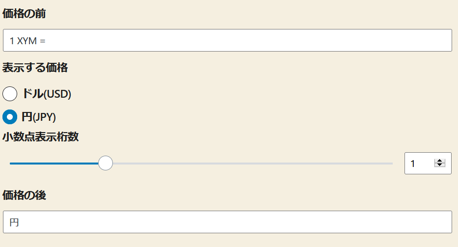
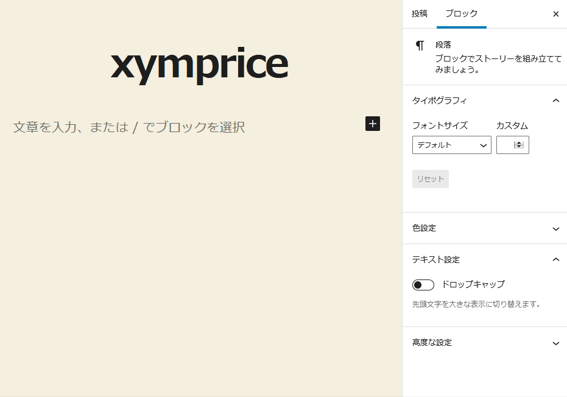

## XYM Price
WordPress plugin: XYM price display via coingecko api

## プラグインの概要
coingecko api を利用して、仮想通貨 xym の価格を表示する WordPress プラグイン。

## API URLの設定
ver 0.9 では、coingecko のみ対応。変更不可。(js/xymprice.jsにべた書き)

## ブロックエディタ
WordPress の編集画面でブロックを選択し、編集する

ブロックメインで設定できるもの

* 価格の前のテキスト
* 表示する価格 - 対USDか、対JPYか
* 価格は小数点何位まで表示するか
* 価格の後のテキスト

サイドバーで設定できるもの

* 文字サイズ

## ライセンス
GPL ver.2.0 or later
